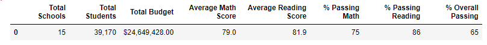
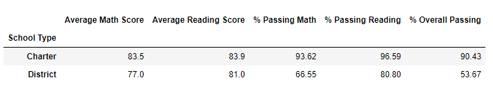
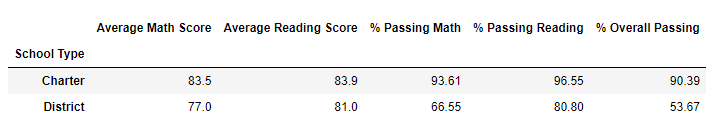

# School District Analysis Challenge
Data was provided for schools in the school district about performance on math and reading scores. There was also information on budgets and spending. With the information provided tables were made using Panda and Jupyter Notebook to explain how the schools in the district were performing with information such as **percentage passing math/reading** and **overall passing percentage**. Information was then broken down even further to discuss performance based on **budget per student, school size, and type of school (Charter or District)**. 

## PythonData Environment
Python version 3.7.11

Jupyter Notebook version 6.4.5

Pandas version 1.3.4

NumPy version 1.20.3

## Analysis Results

### How the District Summary is Affected
#### Original Analysis

A total of 461 students at Thomas High School had empty cells for their reading and math scores which affected the Average Reading/Math Scores, Percentage Passing Reading/Math, and the Overall Passing Percentage. These were replaced with `NaN` (null data) in order to get more accurate results.

#### Adjusted Analysis

After these grades were changed in the data set, there was quite an impact on the numbers. Even though it was only 461 students of the almost 40,000 in the data set, the Overall Passing Percentage was still impacted where the average would appear to drop 1%, even after rounding. The Average Reading/Math Scores and Percentage Passing Reading/Math was not affected as much with having less than 1% change, however the whole numbers rounded would still remain the same.

### How the School Summary is Affected
#### Original Analysis

Focusing on just Thomas High School, at first glance, the Overall Passing Percentage is at 90.94%. This is extrememly high which raised some red flags while compared with other schools. The Percentage of Passing Math and Reading was also extremely high. 

#### Adjusted Analysis

Once the data was adjusted, it is easy to see that the Overall Passing Percentage dropped dramatically, falling to 65.07%. The Percentage of Passing Math and Reading also dropped from in the 90% range to the upper 60% range.

### How Replacing Ninth-Grade Scores Affected Thomas High School's Performance compared with other schools
#### Original Analysis

Before the scores were adjusted, Thomas High School, compared with other schools was ranked 2nd in District.

#### Adjusted Analysis

After the adjustment and Thomas High School has the lower percentages, the school falls into the middle of the listed schools, 8th place from the bottom.

### Adjusted Math and Reading Scores for 9th Graders
#### Original Math and Reading Scores

Thomas High Schools from the original Analysis shows a Math Score of 83.6% and a Reading Score of 83.7%.

### Adjusted Math and Reading Scores

Once adjusted, the Math and Reading Scores now show `NaN` to signify Null Data and allows the data to reflect more accurate results.

### Scores by School Spending
Thomas High School fell in the range of $631-$645 spending. The change is less than a 1% difference, the Overall Passing Percentage changed from 62.86% to 62.78%. Therefore, the 9th grade data did not impact this larger scale analysis as much as the first couple comparisons.

#### Original Analysis

#### Adjusted Analysis

### Scores by School Size
Thomas High School fell in between the data as a Medium sized school. The original anaylsis shows a small change in the Percentages of Passing Math, Reading and Overall. There was a less than 1% change in this data set.

#### Original Analysis

#### Adjusted Analysis

### Scores by School Type
Thomas High School fell in the Charter Type school and there was also a less than 1% change in the overall numbers. The rounded number did not change but showing two places after the decimal gives a more accurate insight of how the 9th graders grades affected these numbers.

#### Original Analysis

#### Adjusted Analysis

## Summary
Overall the 4 major changes to highlight in this Analysis:
1. In the school summary, the Overall Passing Percentage, once the 9th grade scores were adjusted, changed from 91% to 65%.
2. Also, the Percentage of Passing MAth/Reading also changed substantially, starting in the 90s and dropped to the higher 60s.
3. In comparing Thomas High School to other schools, before the adjustment in the data, was ranked 2nd in the District. Once adjusted, they dropped to around the middle of the District, approximately 8 spots from the bottom.
4. Finally, without replacing the 9th grade scores with `NaN` (null data), the data will be skewed and would not be accurate.
